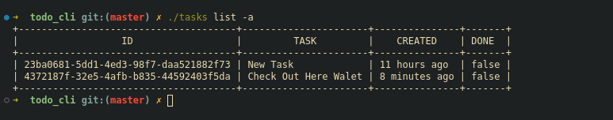

## TODO CLI APPLICATION WITH MONGODB PERSISTENCY




## Overview
Todo cli helps you create and manage your daily todos directly from your commandline

## Getting Started

- Download and run the install script

**Note**: Application is only supported on Linux, Mac and WSL
if your are on windows please use WSL.

```sh
wget https://raw.githubusercontent.com/Ayobami6/todo_cli/refs/heads/master/install.sh
```
- Install 

```sh
./install.sh
```
- Configure the application

```sh
tasks configure
```


